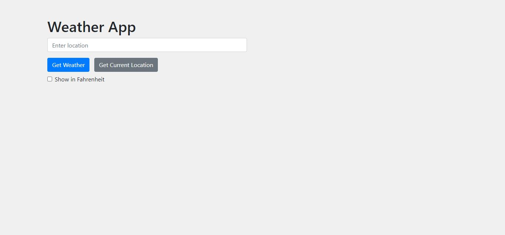
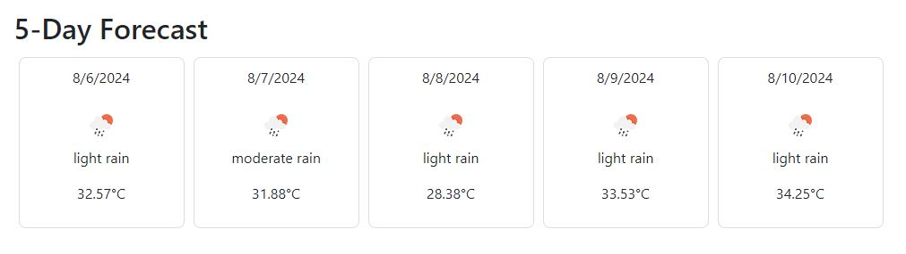

# WeatherApp

WeatherApp is a user-friendly web application that provides current weather information, a 5-day forecast, and hourly weather updates for any location. Leveraging the OpenWeather API, this app displays detailed weather data including temperature, humidity, and weather conditions with icons.

## Features

- **Current Weather**: Get real-time weather updates for any location.
- **5-Day Forecast**: View a detailed 5-day weather forecast.
- **Hourly Forecast**: Check hourly weather predictions for the day.
- **Location Input**: Search weather by entering a location.
- **Current Location**: Automatically fetch weather for your current location using geolocation.
- **Temperature Unit Toggle**: Switch between Celsius and Fahrenheit.

## Technologies Used

- **Frontend**: HTML, CSS (Bootstrap), JavaScript
- **Backend**: None (Client-side API requests)
- **API**: OpenWeather API

## Setup

1. Clone the repository:
    ```sh
    git clone https://github.com/yourusername/WeatherApp.git
    ```
2. Navigate to the project directory:
    ```sh
    cd WeatherApp
    ```
3. Open `index.html` in your web browser.

## Usage

1. Enter a location in the input field and click "Get Weather" to see the current weather, 5-day forecast, and hourly updates.
2. Use the "Get Current Location" button to fetch weather data for your current location.
3. Toggle the temperature unit between Celsius and Fahrenheit using the checkbox.

## Screenshots






## API Key

This project uses the OpenWeather API. You will need to sign up for an API key at [OpenWeather](https://home.openweathermap.org/users/sign_up).

Replace the placeholder `apiKey` in `js/script.js` with your actual API key:
```javascript
const apiKey = 'YOUR_API_KEY';
